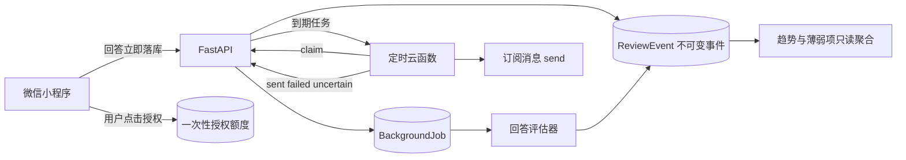

# 学习辅助模块：设计、部署与验收

本阶段包含三个彼此解耦的模块：微信订阅提醒、AI 回答评估、薄弱项与负载统计。数据库迁移为 `0005_learning_assistance`。



## 1. AI 回答评估

回答提交接口先写入 `answer_submitted` 和持久化后台任务，再返回 `pending`。小程序轮询评估结果，但四档评分按钮始终可用；模型超时或失败不会阻塞复习。

评估器只做一次短 Responses 请求，输出：

- 建议等级 `suggested_rating`（1–4）；
- 已覆盖要点与回答证据；
- 缺失要点和补充建议；
- 置信度与安全的模型用量元数据。

模型建议不会传给调度器。只有用户最终选择的 `rating` 会调用 FSRS；评分事件会记录当时的 AI 建议以及用户是否选择了不同等级。

云端建议配置：

```env
APP_ANSWER_EVALUATION_TIMEOUT_SECONDS=15
APP_ANSWER_EVALUATION_MAX_OUTPUT_TOKENS=1000
APP_ANSWER_EVALUATION_REASONING_EFFORT=none
APP_INLINE_WORKER=true
```

用户可在小程序“提醒”页关闭“回答后给出 AI 建议”。关闭后新回答不会创建模型任务，也不会产生模型调用成本。

## 2. 薄弱项、趋势与每日负载

接口：

- `GET /api/v1/review/insights?trend_days=30&forecast_days=14&weak_limit=10`
- `GET /api/v1/review/daily-plan?include_overflow=false`
- 原 `GET /api/v1/review/queue` 保留为“全部到期”入口。

薄弱分为 0–100，综合最近五次最终评分、累计遗忘率和可用的 FSRS difficulty。未复习卡单列为“未复习”，不会被误判成 0 分；逾期只代表紧迫性，不进入薄弱分。

趋势按用户时区做日桶并零填充。界面使用“自评掌握率”，不把用户评分包装成客观正确率。

每日上限是软上限：Learning / Relearning 到期卡可突破上限；其他超额卡进入“全部到期”。负载计算是只读推荐层，不写 `due_at`、`interval_days` 或 `scheduler_state`，也不会提前复习未来卡。

## 3. 微信一次性订阅提醒

### 3.1 创建真实模板

在微信公众平台为目标小程序选择一个订阅消息模板。模板需要能承载以下三个逻辑字段：

| 逻辑字段 | 后端内容 | 示例模板类型 |
| --- | --- | --- |
| `due_count` | 今日建议复习数量 | `number*` |
| `reminder_time` | 用户本地提醒时间 | `time*` |
| `summary` | 简短提醒摘要 | `thing*` |

实际字段名以“我的模板”页面为准，例如可能是 `number1`、`time2`、`thing3`。不要照抄示例，也不要把模板 ID 写入小程序源码。

### 3.2 配置 FastAPI 云托管服务

生成一个足够长的随机共享密钥，只保存到云端环境变量：

```env
APP_REMINDER_DELIVERY_ENABLED=true
APP_REMINDER_DISPATCH_TOKEN=<long-random-shared-secret>
APP_WECHAT_SUBSCRIBE_TEMPLATE_ID=<real-template-id>
APP_WECHAT_SUBSCRIBE_PAGE=pages/review/review
APP_REMINDER_BATCH_SIZE=50
APP_REMINDER_LEASE_SECONDS=120
```

如果模板或共享密钥缺失，状态接口会显示发送服务未就绪。先保持 `APP_REMINDER_DELIVERY_ENABLED=false`，完成下面的云函数配置后再开启。

### 3.3 部署定时云函数

上传 [cloudfunctions/reminder-dispatch](../cloudfunctions/reminder-dispatch/) 为独立云函数，安装其中 `package.json` 的依赖，并配置每 5 分钟触发。云函数环境变量：

```env
MEMORY_AGENT_BASE_URL=https://你的云托管公网域名
MEMORY_AGENT_REMINDER_TOKEN=<与 APP_REMINDER_DISPATCH_TOKEN 完全相同>
WECHAT_TEMPLATE_FIELD_MAP_JSON={"due_count":"number1","reminder_time":"time2","summary":"thing3"}
WECHAT_MINIPROGRAM_STATE=developer
```

`MEMORY_AGENT_BASE_URL` 不附加 `/api/v1`。联调、体验版、正式版分别使用 `developer`、`trial`、`formal`。完整云函数参数和错误边界见 [云函数 README](../cloudfunctions/reminder-dispatch/README.md)。

定时任务放在云函数而不是 FastAPI 容器内：容器实例可能缩容或重启，不适合依赖进程内 cron。FastAPI 只负责按用户时区原子领取任务、占用一次性授权、去重和保存结果。

### 3.4 真机闭环验收

订阅授权必须在用户点击事件中直接调用 `wx.requestSubscribeMessage`，开发者工具不能替代最终真机验证。

1. 在“提醒”页点击“授权一次复习提醒”并同意；可用次数应增加 1。
2. 将提醒时间临时调到当前时间之前，并确认至少有一张到期卡。
3. 临时把云函数 cron 调快，观察 claim、微信发送和 result 回写。
4. 真机收到消息后，可用次数减 1，发送状态为 `sent`。
5. 再触发一次，同一用户、模板和本地日期不得重复发送。
6. 模拟微信超时或发送后回写中断，任务应为 `uncertain`，不得自动重发。
7. 验证另一个 OpenID 无法读取当前用户的授权、评估或统计数据。

## 当前验证边界

仓库可自动验证 Fake 模型评估、后台任务幂等、统计只读性、提醒额度和发送去重。真实微信消息仍依赖你的小程序模板 ID、实际字段名和云环境权限，因此在完成上述真机步骤前，只能声称“发送链路已实现并通过本地模拟”，不能声称“线上订阅消息已验证”。
