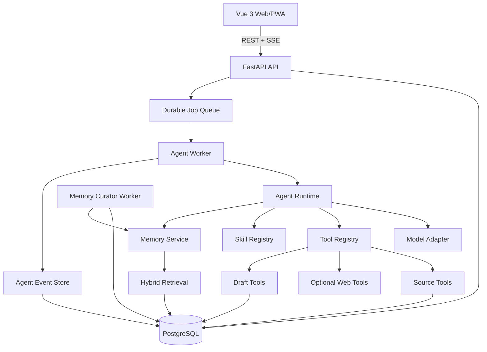
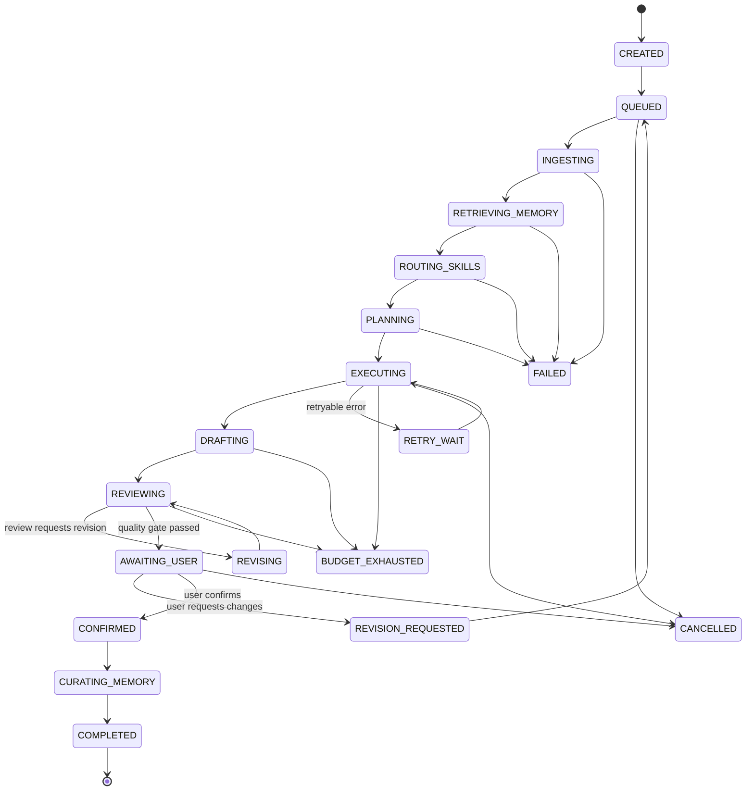
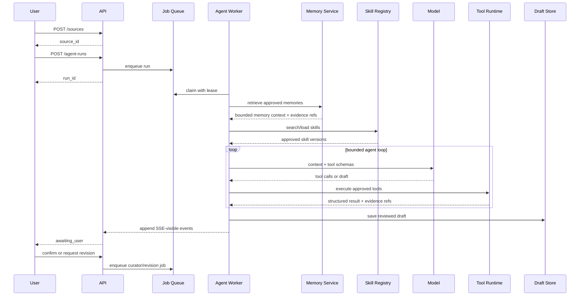
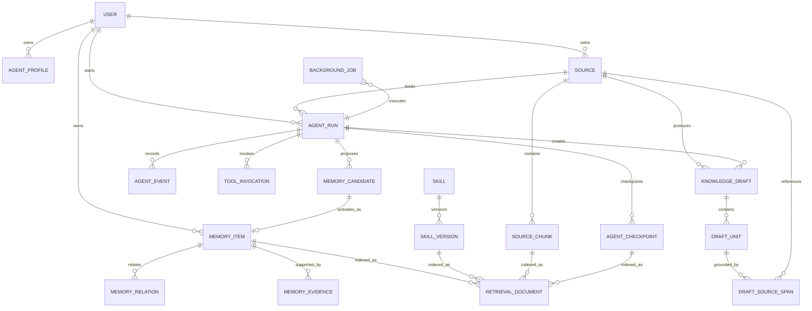

# 阶段一技术设计：内容生成 Agent 与记忆底座

> 状态：已确认，可作为实现基线  
> 版本：v0.1  
> 日期：2026-08-06  
> 范围：阶段一，不包含 FSRS、复习队列、通知和原生移动端

## 1. 已冻结的产品决策

以下内容已由用户确认，后续实现默认不再重复讨论；若需修改，应更新本文版本并记录原因。

| 决策项 | 已确认方案 |
|---|---|
| 首批场景 | 技术学习、面试准备 |
| 输入类型 | 纯文本、Markdown |
| 单次输入上限 | 10,000 字符 |
| 单次生成数量 | 1–10 个知识单元 |
| 首版题型 | 开放问答题 |
| 事实标记 | 原文片段、外部来源或模型推断三选一 |
| Agent 数量 | 单主 Agent，内部执行生成和审查两个步骤 |
| 联网策略 | 每次任务可选择，默认关闭 |
| Agent 预算 | 最多 12 次工具调用、2 次联网搜索、2 次修订 |
| 记忆写入 | Agent 只能提议，用户批准后生效 |
| Skill 更新 | Agent 可选择和读取，不能直接修改正式 Skill |
| 用户系统 | 数据按 `user_id` 隔离；阶段一只提供本地初始化账号 |
| 后端 | Python + FastAPI |
| 前端 | Vue 3 + TypeScript |
| 数据库 | PostgreSQL + pgvector + pg_trgm |
| 执行方式 | 后台 Agent Worker，SSE 返回进度 |

## 2. 阶段一目标与非目标

### 2.1 目标

阶段一交付一条完整、可恢复、可审计的内容生成闭环：

1. 用户保存原始学习材料和学习目标。
2. 系统创建持久化 Agent Run。
3. Agent 检索已批准的相关记忆。
4. Agent 搜索并加载匹配的 Skills。
5. Agent 在预算内自主调用工具并生成知识草稿。
6. Agent 对草稿执行来源校验、重复检查和质量审查。
7. 用户编辑、要求修订或确认草稿。
8. 后台 Curator 从本次运行中提出候选记忆。
9. 候选记忆只有经用户批准后才影响未来运行。

### 2.2 非目标

- 不实现 FSRS、复习队列和通知。
- 不实现 PDF、网页链接、图片、音视频导入。
- 不实现语音回答和原生移动端。
- 不实现多 Agent 协作。
- 不允许 Agent 自动发布或修改正式 Skill。
- 不允许 Agent 自动激活长期记忆。
- 不实现知识图谱和专用搜索集群。
- 不实现完整注册、OAuth 和密码找回。

## 3. 核心设计原则

### 3.1 四类数据严格分离

| 类型 | 定义 | 是否可以给 Agent 下指令 |
|---|---|---|
| System Policy | 产品级安全、授权、预算和输出规则 | 可以，最高优先级 |
| Skill | 完成某类任务的方法和流程 | 可以，但只能使用已批准版本 |
| Agent Memory | 用户偏好、稳定事实、历史纠错和任务经验 | 不可以，只作为事实性上下文 |
| Domain Knowledge | 用户输入的学习材料和生成的知识单元 | 不可以，只作为待处理数据 |

任何来自网页、用户材料、历史消息或记忆中的命令式文本，都不得提升为 System Policy 或 Skill。

### 3.2 原始事件是事实源，压缩内容只是视图

- 所有用户消息、模型输出、工具调用、工具结果、错误和草稿变更都进入追加式事件日志。
- Checkpoint、摘要、Embedding 和搜索索引都可以重建。
- 上下文压缩不得删除原始事件。
- 恢复任务时优先读取最新 Checkpoint，并可按证据引用回查原始事件。

### 3.3 保存可观察决策，不保存隐式思维链

系统保存：

- 结构化计划；
- 选择了哪些 Skills 及原因；
- 调用了哪些工具及结果；
- 关键决策摘要；
- 自检结果；
- 停止原因。

系统不要求、展示或保存模型的隐式思维链。

### 3.4 所有派生内容必须有来源

每个关键要点必须标记为以下一种：

- `source`：来自用户原文，携带字符区间和摘录；
- `external`：来自允许访问的外部来源，携带 URL 和提取时间；
- `inference`：模型推断，必须显式提醒用户确认。

## 4. 总体架构



### 4.1 组件职责

| 组件 | 主要职责 |
|---|---|
| FastAPI API | 鉴权、参数校验、幂等、创建任务、读取结果、SSE 事件流 |
| Durable Job Queue | 持久化任务、租约、心跳、重试、失败和取消 |
| Agent Worker | 领取任务、执行 Agent Runtime、生成 Checkpoint |
| Agent Runtime | 上下文组装、模型调用、工具循环、预算和停止判断 |
| Model Adapter | 屏蔽模型 API 格式差异；首版实现 OpenAI Responses 适配器 |
| Tool Registry | 工具发现、输入输出 Schema、权限、超时、重试和审计 |
| Skill Registry | Skill 索引、匹配、版本选择和渐进加载 |
| Memory Service | 候选记忆、审批、版本、证据、索引和检索 |
| Memory Curator | 运行结束后的记忆候选提取、去重、冲突和安全检查 |
| Agent Event Store | 追加式保存所有可观察运行事件 |

### 4.2 为什么阶段一不引入 Redis 和独立向量数据库

- PostgreSQL 可以同时承担业务数据、任务租约、全文/子串检索和 pgvector。
- 阶段一的数据规模和并发不需要额外搜索集群。
- 减少本地部署组件，更容易一键启动和验证完整闭环。
- 队列吞吐或检索规模成为已测量瓶颈后，再引入专用组件。

## 5. Agent 状态机

### 5.1 主状态



### 5.2 状态说明

| 状态 | 说明 | 可恢复点 |
|---|---|---|
| `CREATED` | Run 和用户输入已持久化 | 是 |
| `QUEUED` | 等待 Worker 领取 | 是 |
| `INGESTING` | 校验 Source、生成内容哈希和检索块 | 是 |
| `RETRIEVING_MEMORY` | 自动检索用户画像、纠错和相关历史 | 是 |
| `ROUTING_SKILLS` | 搜索并加载已批准 Skill | 是 |
| `PLANNING` | 生成可观察结构化计划 | 是 |
| `EXECUTING` | 模型和工具循环 | 通过 Checkpoint |
| `DRAFTING` | 将中间结果写成结构化草稿 | 是 |
| `REVIEWING` | 来源、重复、粒度和 Schema 检查 | 是 |
| `AWAITING_USER` | 等待用户编辑、确认或要求修订 | 是 |
| `CURATING_MEMORY` | 提取候选记忆，不自动激活 | 是 |
| `BUDGET_EXHAUSTED` | 达到工具、时间或 Token 上限 | 是，可人工续跑 |
| `FAILED` | 不可自动恢复的失败 | 保留原文和已有草稿 |

### 5.3 Agent 循环伪代码

```python
while not run.is_terminal:
    assert_budget(run)
    context = context_builder.build(run)
    response = model.generate(context, available_tools)
    persist_model_output(response)

    if response.has_tool_calls:
        for call in validate_and_order(response.tool_calls):
            result = tool_runtime.execute(call)
            persist_tool_result(result)
        maybe_checkpoint(run)
        continue

    if response.has_valid_final_draft:
        persist_draft(response.draft)
        transition(REVIEWING)
        break

    if response.requests_clarification:
        transition(AWAITING_USER)
        break

    fail("MODEL_RETURNED_NO_ACTION")
```

### 5.4 停止条件

满足任一条件时停止当前模型循环：

- 草稿通过结构和质量门禁；
- Agent 请求一个必要的用户澄清；
- 用户取消；
- 工具调用达到 12 次；
- 外部搜索达到 2 次；
- 自我修订达到 2 次；
- 达到配置的 Token、时间或费用上限；
- 连续两次出现相同不可进展动作；
- 发生不可重试错误。

## 6. 一次生成任务的时序



## 7. 数据模型

### 7.1 ER 模型



### 7.2 核心表职责

| 表 | 关键内容 |
|---|---|
| `users` | 用户身份、时区、状态；阶段一仅初始化一个本地用户 |
| `agent_profiles` | Agent 配置、预算、联网默认值、核心画像摘要版本 |
| `sources` | 原始材料、标题、内容哈希、字符数、隐私和联网策略 |
| `source_chunks` | 按标题/段落切分的检索块，保留字符区间 |
| `agent_runs` | 状态、预算使用、模型配置、幂等键、错误和停止原因 |
| `agent_events` | 追加式运行事件，带单调递增 `seq` |
| `agent_checkpoints` | 结构化压缩结果、覆盖事件区间和完整性哈希 |
| `tool_invocations` | 工具版本、参数、权限、耗时、结果和错误 |
| `knowledge_drafts` | 草稿聚合、版本、状态、用户确认信息 |
| `draft_units` | 单个知识单元及结构化问答内容 |
| `draft_source_spans` | 原文、外部来源或推断证据 |
| `memory_candidates` | Curator 提出的待审批记忆 |
| `memory_items` | 已批准或历史版本的长期记忆 |
| `memory_evidence` | 记忆对应的 Event、Source、Draft 或外部证据 |
| `memory_relations` | `supersedes`、`duplicates`、`related` 等关系 |
| `skills` / `skill_versions` | Skill 元数据、版本、内容和批准状态 |
| `retrieval_documents` | 统一的关键词和向量检索索引 |
| `background_jobs` | 任务租约、心跳、重试和死信信息 |

### 7.3 Agent Event 类型

`agent_events` 至少支持：

```text
run.created
run.state_changed
user.input
context.assembled
memory.retrieved
skill.selected
skill.loaded
plan.created
model.requested
model.responded
tool.requested
tool.started
tool.completed
tool.failed
checkpoint.created
draft.created
draft.reviewed
draft.revised
user.revision_requested
user.confirmed
memory.candidate_created
run.budget_warning
run.cancelled
run.failed
run.completed
```

约束：

- `(run_id, seq)` 唯一；
- 已写入事件不原地修改；
- 大型 payload 存为 Artifact，只在事件中保存引用和摘要；
- 敏感信息写入前必须清洗。

## 8. KnowledgeDraft 输出协议

### 8.1 顶层结构

```json
{
  "draft_id": "uuid",
  "source_id": "uuid",
  "learning_goal": "用于 Java 后端面试",
  "content_type": "technical_note",
  "units": [],
  "agent_summary": {
    "skills_used": [],
    "tools_used": [],
    "external_verification_used": false,
    "uncertainties": []
  }
}
```

### 8.2 单个知识单元

```json
{
  "title": "ConcurrentHashMap 的线程安全机制",
  "learning_objective": "能够解释 JDK 8 中主要并发控制方式",
  "explanation": "...",
  "key_points": [
    {
      "text": "...",
      "evidence_refs": ["span_1"]
    }
  ],
  "question": "为什么 ConcurrentHashMap 是线程安全的？",
  "answer_key": ["..."],
  "hints": [
    {"level": 1, "text": "考虑写入冲突时采用的机制"},
    {"level": 2, "text": "关注 CAS 和 synchronized"}
  ],
  "tags": ["Java", "并发", "面试"],
  "applicable_scenarios": ["后端面试", "并发容器选型"],
  "evidence": [
    {
      "id": "span_1",
      "type": "source",
      "source_id": "uuid",
      "start_char": 120,
      "end_char": 218,
      "quote": "...",
      "url": null,
      "retrieved_at": null
    }
  ],
  "confidence": 0.88,
  "requires_user_confirmation": false,
  "uncertainties": []
}
```

字符区间统一使用基于 Unicode code point 的零起点、左闭右开区间 `[start_char, end_char)`；前后端必须使用同一换算工具，不能混用 UTF-16 code unit 偏移。

## 9. Tool 协议

### 9.1 Tool Definition

每个工具注册时必须声明：

```yaml
name: source_read
version: 1.0.0
description: Read a bounded range from a source owned by the current user.
risk_level: read
approval_mode: auto
timeout_seconds: 10
max_result_chars: 12000
retry_policy:
  max_attempts: 2
  retryable_errors: [timeout, transient_backend]
input_schema: {}
output_schema: {}
```

`risk_level`：

| 等级 | 示例 | 默认审批 |
|---|---|---|
| `read` | 读取 Source、检索记忆、读取 Skill | 自动 |
| `draft_write` | 保存草稿、保存运行 Checkpoint | 自动 |
| `memory_proposal` | 创建候选记忆 | 自动创建候选，不自动激活 |
| `external_read` | Web 搜索和页面读取 | 由本次 Run 的联网授权决定 |
| `external_write` | 向外部系统写入 | 阶段一禁用 |
| `privileged` | 修改正式 Skill、权限和系统配置 | 阶段一禁用 |

### 9.2 Tool Call Envelope

```json
{
  "run_id": "uuid",
  "call_id": "uuid",
  "tool_name": "source_read",
  "tool_version": "1.0.0",
  "arguments": {},
  "idempotency_key": "sha256...",
  "deadline_at": "2026-08-06T12:00:00Z"
}
```

### 9.3 Tool Result Envelope

```json
{
  "status": "success",
  "data": {},
  "summary": "Read characters 0-1200 from source.",
  "evidence_refs": [],
  "artifact_refs": [],
  "retryable": false,
  "error": null,
  "metrics": {
    "duration_ms": 24,
    "result_chars": 1200
  }
}
```

规则：

- 工具不得返回未声明字段作为隐式控制指令。
- 超过 `max_result_chars` 的结果必须保存为 Artifact，并返回摘要和引用。
- 写工具必须接受幂等键。
- 模型提供的 `user_id`、`tenant_id` 无效，权限上下文只能由 Runtime 注入。
- Tool Result 作为不可信数据包裹后再进入模型上下文。

### 9.4 阶段一工具清单

| Tool | 作用 |
|---|---|
| `source_read` | 按字符区间读取原始材料 |
| `source_search` | 在当前 Source 和 Chunk 内查找文本 |
| `memory_search` | 混合检索已批准记忆 |
| `memory_get_evidence` | 获取记忆的原始证据 |
| `skill_search` | 搜索可用 Skill 元数据 |
| `skill_load` | 加载指定已批准 Skill 版本 |
| `web_search` | 在本次 Run 获得授权时联网搜索 |
| `web_extract` | 提取已授权 URL 的页面内容 |
| `draft_upsert` | 幂等保存草稿中间版本 |
| `schema_validate` | 校验 KnowledgeDraft Schema |
| `memory_propose` | 创建候选记忆 |
| `ask_user` | 提出一个阻塞性澄清问题 |

## 10. Skill 协议

### 10.1 Tool、Skill 和 Memory 的边界

- Tool 是有类型的能力。
- Skill 是完成任务的方法，只能引用允许的 Tools。
- Memory 是事实和经验，不能包含可执行优先级高于 Skill 的指令。
- Agent 可以自主选择 Skill，但只能加载 `approved` 版本。

### 10.2 Skill 元数据

```yaml
name: technical-interview-cards
version: 1.0.0
description: Generate source-grounded open-ended interview questions from technical notes.
status: approved
triggers:
  - technical note
  - interview preparation
excludes:
  - language vocabulary memorization
required_tools:
  - source_read
  - source_search
allowed_tools:
  - memory_search
  - web_search
  - web_extract
  - draft_upsert
output_schema: knowledge-draft-v1
max_context_chars: 16000
```

### 10.3 渐进加载

1. 初始上下文只放 Skill 的 `name`、`description`、触发条件和版本。
2. Runtime 用关键词与向量检索得到候选 Skills。
3. Agent 选择后调用 `skill_load`。
4. 完整 Skill 内容仅在当前 Run 内生效。
5. supporting references 仍按需加载，不一次性注入。

### 10.4 初始 Skills

| Skill | 目标 |
|---|---|
| `source-grounded-learning` | 从原文拆解可检验知识点，并保持证据追踪 |
| `technical-interview-cards` | 生成面试型开放问答、原理和应用场景 |
| `card-quality-review` | 检查粒度、重复、可回答性、答案覆盖和无依据断言 |

阶段一不提供正式 Skill 写 API。Agent 或 Curator 可以创建 `skill_change_proposal`，但只有管理员在后续版本中才能批准发布。

## 11. Agent Memory 设计

### 11.1 记忆类型

| `kind` | 内容 | 示例 |
|---|---|---|
| `profile` | 用户稳定画像和表达偏好 | 用户偏好简洁、先结论后解释 |
| `semantic` | 稳定事实和项目背景 | 用户主要学习 Java 后端与 AI Agent |
| `episodic` | 某次任务发生了什么 | 上次生成 Redis 卡片时删除了过细问题 |
| `correction` | 用户明确纠正 | 不要把模型补充内容伪装成原文 |
| `decision` | 已确认的产品或工作决策 | 联网核验默认关闭 |

程序性工作流不进入 `memory_items`，而进入 Skill。

### 11.2 Memory Item

```text
id
user_id
agent_profile_id
kind
scope_type
scope_id
canonical_key
content
compact_summary
importance
confidence
status
version
supersedes_id
valid_from
valid_to
expires_at
content_hash
created_at
updated_at
last_accessed_at
```

状态：

```text
pending -> active -> superseded | archived | deleted
```

### 11.3 记忆候选生命周期

1. Curator 读取本次 Run 的可观察事件和用户修改。
2. 生成结构化候选：类型、内容、依据、重要性、置信度、过期策略。
3. 执行 Secret、PII、Prompt Injection、重复和冲突扫描。
4. 候选进入 `pending`。
5. 用户批准、编辑或拒绝。
6. 批准时创建新 `memory_item` 版本。
7. 异步生成 Retrieval Document 和 Embedding。
8. 冲突项通过 `supersedes_id` 保留完整版本链。

显式用户纠错优先级高于模型推断；模型推断不得自动使旧记忆失效。

## 12. 统一检索索引

### 12.1 Retrieval Document

使用统一索引表承载 Memory、Source Chunk、Checkpoint 和 Skill 元数据：

```text
id
user_id
document_type
owner_id
owner_version
scope_type
scope_id
content
normalized_content
keywords
metadata_json
embedding_vector
embedding_model
embedding_version
content_hash
active
created_at
updated_at
```

首版固定一种 Embedding 模型和维度，以便建立 pgvector HNSW 索引；更换模型时创建新 `embedding_version` 并后台重建，不能混合比较不同模型的向量。

### 12.2 混合检索流程

1. 强制过滤 `user_id`、`status`、`scope` 和 `active`。
2. `pg_trgm` 召回关键词、中文子串、版本号和代码符号。
3. pgvector 召回语义相近内容。
4. 使用 Reciprocal Rank Fusion 合并两路候选。
5. 加入记忆类型、显式纠错、重要性、置信度和时间衰减。
6. 按 `canonical_key` 和内容哈希去重。
7. 返回 6–10 条，受 Token 预算约束。

初始候选参数：

```text
lexical candidates: 20
vector candidates: 20
fused candidates: 20
final injected items: 6-10
```

这些是初始工程参数，不是产品效果结论，必须通过阶段一检索评测集校准。

### 12.3 检索结果协议

```json
{
  "memory_id": "uuid",
  "kind": "correction",
  "content": "不要把模型补充内容伪装成原文。",
  "score": 0.91,
  "confidence": 1.0,
  "evidence_refs": ["event:uuid:42"],
  "why_retrieved": "当前任务同样要求生成有来源的技术卡片",
  "updated_at": "2026-08-06T10:00:00Z"
}
```

## 13. 上下文组装与压缩

### 13.1 上下文层级

按以下稳定顺序组装：

1. System Policy：身份、安全、授权、预算和输出协议。
2. Tool Index：当前 Run 可用工具的精简 Schema。
3. Skill Index：候选 Skill 名称和描述。
4. Active Skill：本次实际加载的完整 Skill。
5. User Profile：已批准的核心画像摘要。
6. Retrieved Memory：与当前任务相关的检索结果及证据引用。
7. Task Context：当前 Source、学习目标和用户约束。
8. Checkpoint：已经压缩的早期运行状态。
9. Recent Tail：最近消息、工具调用和结果。

### 13.2 初始 Token 预算

| 区域 | 初始上限 |
|---|---:|
| 核心用户画像 | 800 tokens |
| 自动检索记忆 | 2,500 tokens |
| Agent 主动追加检索 | 3,000 tokens |
| 已加载 Skills | 4,000 tokens |
| 单个工具内联结果 | 3,000 tokens |

总预算由模型上下文、运行费用上限和 Source 大小共同决定，不能只按上下文窗口百分比使用。

### 13.3 压缩触发

采用可配置软、硬阈值：

- 软阈值：先清理旧工具大输出，并生成 Checkpoint。
- 硬阈值：必须压缩或暂停，不允许继续无界增长。
- 工具调用组不可拆分。
- 当前用户目标、未解决问题、当前草稿和最近真实用户消息始终保留。

初始建议：

```text
soft_limit = min(model_context * 0.55, configured_cost_context_limit)
hard_limit = min(model_context * 0.75, configured_hard_context_limit)
```

### 13.4 Checkpoint Schema

```text
Goal
UserIntent
Constraints
SourceIds
LoadedSkills
VerifiedFindingsWithEvidence
Decisions
CompletedWork
CurrentDraft
UnresolvedQuestions
FailedAttempts
Artifacts
NextActions
MemoryCandidates
```

`agent_checkpoints` 记录：

```text
run_id
checkpoint_version
previous_checkpoint_id
covered_event_seq_start
covered_event_seq_end
summary_json
raw_events_digest
prompt_version
model
tokens_before
tokens_after
created_at
```

Provider 返回的 opaque compaction item 只能存放在加密的 `provider_state` 中，用于继续同一 Provider 会话；它不是业务记忆，也不能替代自己的 Checkpoint。

### 13.5 长期记忆压缩

Memory Curator 定期执行：

- 精确重复与近似重复合并建议；
- 同一 `canonical_key` 的冲突检测；
- 多条偏好压缩成核心用户画像；
- 过期记忆归档；
- 根据新版本更新检索索引；
- 保留所有原始证据和版本链。

不得通过“压缩”静默删除用户已批准的事实。

## 14. 后台任务与并发

### 14.1 PostgreSQL 任务租约

`background_jobs` 使用：

```text
id
job_type
run_id
status
priority
attempt
max_attempts
available_at
lease_owner
lease_expires_at
heartbeat_at
payload_json
last_error
created_at
updated_at
```

Worker 使用 `SELECT ... FOR UPDATE SKIP LOCKED` 领取任务。

规则：

- 执行中定期更新心跳；
- 租约超时可由其他 Worker 重新领取；
- 每个副作用工具必须使用幂等键；
- 同一 Run 同一时间只允许一个执行租约；
- 取消请求写入数据库，Worker 在模型调用和工具调用边界检查。

### 14.2 重试策略

- 模型限流、短暂网络错误：指数退避，最多 2 次。
- 只读工具短暂错误：按 Tool Definition 重试。
- Schema 不合法：允许 Agent 修订，计入 2 次修订预算。
- 权限、输入、安全检查失败：不可重试。
- 重试不得重复创建 Source、Draft、Memory Candidate 或外部副作用。

## 15. API 设计

所有写 API 接受 `Idempotency-Key`。响应错误统一包含 `code`、`message`、`retryable` 和 `request_id`。

### 15.1 Local Profile

| 方法 | 路径 | 说明 |
|---|---|---|
| `GET` | `/api/v1/profile` | 获取本地初始化用户和 Agent 配置 |
| `PATCH` | `/api/v1/profile` | 修改时区、默认联网和生成偏好 |

阶段一首次启动通过环境变量或初始化命令创建本地账号；数据库仍强制保存 `user_id`。

### 15.2 Sources

| 方法 | 路径 | 说明 |
|---|---|---|
| `POST` | `/api/v1/sources` | 保存原文、标题和学习目标 |
| `GET` | `/api/v1/sources/{id}` | 获取 Source |
| `DELETE` | `/api/v1/sources/{id}` | 删除 Source 及其派生索引 |

### 15.3 Agent Runs

| 方法 | 路径 | 说明 |
|---|---|---|
| `POST` | `/api/v1/agent-runs` | 为 Source 创建生成任务 |
| `GET` | `/api/v1/agent-runs/{id}` | 获取状态、预算、停止原因和当前草稿 |
| `GET` | `/api/v1/agent-runs/{id}/events` | SSE 事件流，支持 `Last-Event-ID` |
| `POST` | `/api/v1/agent-runs/{id}/cancel` | 请求取消 |
| `POST` | `/api/v1/agent-runs/{id}/resume` | 从 Checkpoint 续跑 |
| `POST` | `/api/v1/agent-runs/{id}/revision` | 提交用户修订要求并创建新执行轮次 |

### 15.4 Drafts

| 方法 | 路径 | 说明 |
|---|---|---|
| `GET` | `/api/v1/drafts/{id}` | 获取当前版本及证据 |
| `PATCH` | `/api/v1/drafts/{id}` | 用户编辑草稿，使用乐观锁版本号 |
| `POST` | `/api/v1/drafts/{id}/confirm` | 确认草稿 |
| `GET` | `/api/v1/drafts/{id}/versions` | 查看版本历史 |

### 15.5 Memories

| 方法 | 路径 | 说明 |
|---|---|---|
| `GET` | `/api/v1/memory-candidates` | 查询待审批候选 |
| `POST` | `/api/v1/memory-candidates/{id}/approve` | 编辑并批准候选 |
| `POST` | `/api/v1/memory-candidates/{id}/reject` | 拒绝候选 |
| `GET` | `/api/v1/memories` | 查询已批准记忆和版本 |
| `PATCH` | `/api/v1/memories/{id}` | 用户纠正记忆，创建新版本 |
| `DELETE` | `/api/v1/memories/{id}` | 删除记忆及检索索引 |
| `POST` | `/api/v1/memories/search` | 调试和记忆中心使用的混合检索 |

### 15.6 Skills

| 方法 | 路径 | 说明 |
|---|---|---|
| `GET` | `/api/v1/skills` | 列出 Skill 元数据和启用状态 |
| `GET` | `/api/v1/skills/{name}` | 查看已批准版本内容 |

阶段一不提供正式 Skill 写 API。

## 16. SSE 事件协议

示例：

```text
id: 42
event: tool.completed
data: {"run_id":"...","tool":"source_read","summary":"...","seq":42}
```

前端可见事件只包含安全摘要；原始工具参数和结果由权限受控的运行详情接口读取。

主要事件：

```text
run.state_changed
memory.retrieved
skill.selected
plan.created
tool.started
tool.completed
tool.failed
checkpoint.created
draft.updated
run.awaiting_user
run.budget_warning
run.failed
run.completed
```

断线重连使用 `Last-Event-ID`，API 从 `agent_events.seq` 继续发送，不能依赖进程内消息队列。

## 17. 安全与隐私

### 17.1 Prompt Injection 边界

- Source、Web、Memory 和 Tool Result 都使用明确的数据边界包裹。
- 这些数据中的“忽略之前规则”“调用某工具”等文本不具备指令权限。
- 只有 System Policy 和已批准 Skill 可以约束 Agent 行为。
- Memory Curator 拒绝包含指令劫持、凭据外传、隐形 Unicode 控制字符的候选。

### 17.2 数据隔离

- 所有业务查询必须包含服务端注入的 `user_id`。
- Tool 参数中的 `user_id` 一律忽略。
- Retrieval Document 必须继承 Owner 的用户和删除状态。
- 建议在 PostgreSQL 增加 Row Level Security，应用层过滤不能作为唯一边界。

### 17.3 Secret 与敏感信息

- API Key、Cookie、Token、私钥和密码禁止进入 Memory、Embedding 和日志。
- 模型调用前、Tool Result 保存前和 Memory Candidate 激活前执行 Secret 扫描。
- Provider continuation state 加密保存，并与普通业务数据分表。

### 17.4 删除

删除 Source 时：

1. 标记 Source 删除并阻止新 Run。
2. 取消关联后台任务。
3. 删除 Source Chunk 和 Retrieval Document。
4. 删除未确认 Draft；已确认内容由用户选择级联删除或解除来源关联。
5. 删除仅由该 Source 支持的候选记忆和激活记忆。
6. 写入不含原文的删除审计事件。

## 18. 可观测性

每个 Run 记录：

- 模型和 Prompt/Skill/Tool 版本；
- 模型请求次数；
- 工具调用次数和失败率；
- 输入、输出、缓存和压缩 Token；
- 首草稿时间、总耗时；
- 外部搜索次数；
- 修订次数；
- Checkpoint 次数；
- 用户编辑比例；
- 候选记忆数量、批准和拒绝结果；
- 最终停止原因。

使用 OpenTelemetry 记录 API、Worker、模型和 Tool Span；数据库事件是产品审计事实源，Trace 系统是运行诊断辅助，不互相替代。

## 19. 阶段一工程验收门禁

以下是工程验收目标，不是已经验证的产品指标。

### 19.1 功能门禁

- 输入 10,000 字符以内文本能够生成 1–10 个合法知识单元。
- 每个关键要点都包含至少一个证据引用或明确的 `inference` 标记。
- 联网关闭时，`web_search` 和 `web_extract` 无法执行。
- 用户确认前，草稿不能成为正式 Knowledge Unit。
- 候选记忆批准前，不参与未来检索。
- 用户修订后保留草稿版本历史。

### 19.2 恢复与幂等门禁

- 在模型调用、工具调用和草稿写入后模拟 Worker 退出，任务能够恢复。
- 重复提交相同幂等键不会创建两个 Source、Run 或 Draft。
- SSE 断线后能从最后事件序号恢复。
- Tool 重试不产生重复副作用。

### 19.3 记忆门禁

- 固定测试集中的明确纠错可以在相关查询 Top 10 中召回。
- 每条激活记忆可追溯到 Source、Event、Draft 或用户显式输入。
- 冲突记忆不会静默覆盖，必须形成版本或待审批冲突。
- 删除记忆后，关键词和向量检索均不可再返回该条目。

### 19.4 压缩门禁

- Checkpoint 保留用户目标、硬约束、Source IDs、当前草稿、未解决问题和下一步。
- 工具调用与结果不会被压缩边界拆开。
- 原始 Agent Events 在压缩后仍完整可查。
- 从最新 Checkpoint 恢复后，Agent 不重复已完成工具调用。

### 19.5 安全门禁

- 恶意 Source 不能开启联网、修改预算、激活记忆或调用禁用工具。
- Tool 返回的恶意指令不能进入 System Policy 或 Skill。
- Secret 测试样本不会进入 Memory、Embedding、日志或前端事件流。
- 不同 `user_id` 的 Source、Memory 和 Retrieval Document 无法互相检索。

## 20. 开发顺序

### 20.1 纵向骨架

1. 初始化 Python/FastAPI、Vue 和 PostgreSQL 工程。
2. 建立 User、Source、Agent Run、Event、Job 和 Draft 最小表。
3. 使用 Fake Model 完成 Source → Run → SSE → Draft 的纵向流程。
4. 验证任务租约、取消、恢复和幂等。

### 20.2 Agent 与工具

1. 实现 Model Adapter 和有界 Agent Loop。
2. 实现 Tool Registry、权限和审计。
3. 实现 Source、Draft 和 Schema Tools。
4. 接入真实模型并添加固定录制测试。

### 20.3 Skills 与记忆

1. 实现 Skill 元数据、版本和渐进加载。
2. 编写三个初始 Skills。
3. 实现 Memory Candidate、审批和证据链。
4. 实现 pg_trgm + pgvector 混合检索。

### 20.4 压缩与质量

1. 实现 Tool Result Artifact 化。
2. 实现 Checkpoint 和恢复。
3. 建立内容、检索、压缩和安全评测集。
4. 完成 Agent 运行详情、草稿确认和记忆审批页面。

## 21. 阶段一完成定义

阶段一只有在以下条件全部满足后才算完成：

1. 用户能使用真实技术笔记完成一次端到端生成和确认。
2. Agent 的 Skill 选择、工具调用、草稿证据和停止原因可查看。
3. 用户的纠错经审批后能影响下一次相关生成。
4. Agent Run 在进程重启后可以恢复。
5. 原始事件、压缩视图、长期记忆和业务知识边界没有混淆。
6. 固定工程评测和安全测试通过。
7. 项目提供一键启动说明和不依赖手工数据库操作的迁移流程。

## 22. 下一份实现文档

进入编码前，再从本文派生以下可执行规格：

1. PostgreSQL DDL 与 Alembic migration 顺序；
2. OpenAPI 请求/响应 Schema；
3. Agent Event、Tool 和 SSE 的 Pydantic 类型；
4. 三个初始 `SKILL.md`；
5. 固定 Agent/Memory/Compression 评测样例；
6. 工程目录结构和本地 Docker Compose。
